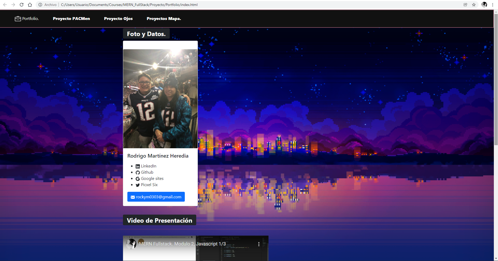

# Portfolio

## Description

Proyecto mostrando lo aprendido en estos 10 módulos, respecto a html, javascript y css , es una página sencilla de mostrando información respecto a mi, que tienen modos de contacto, redes sociales, etc. Como tambien una breve biografía y un video sobre mi.

## How to run

Debes abrir el archivo index.html en tu browser de preferencia; puedes abrir la página index.html, donde podrás navegar y ver vínculos a otros repositorios y otras páginas externas.

## Improvements

Agregar un modo nocturno.

## Excersice PACMen

